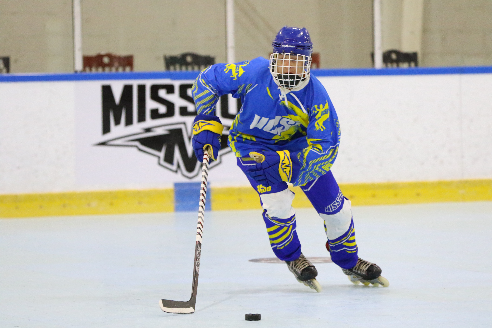
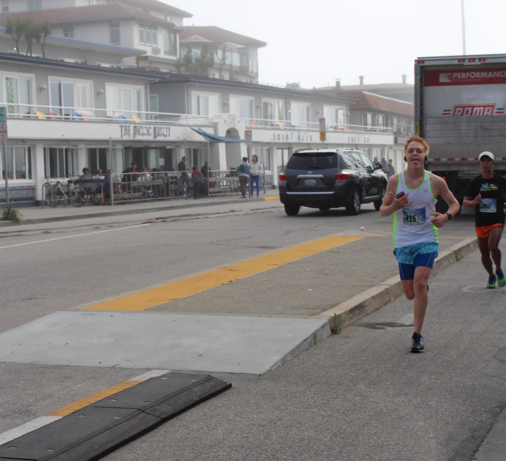
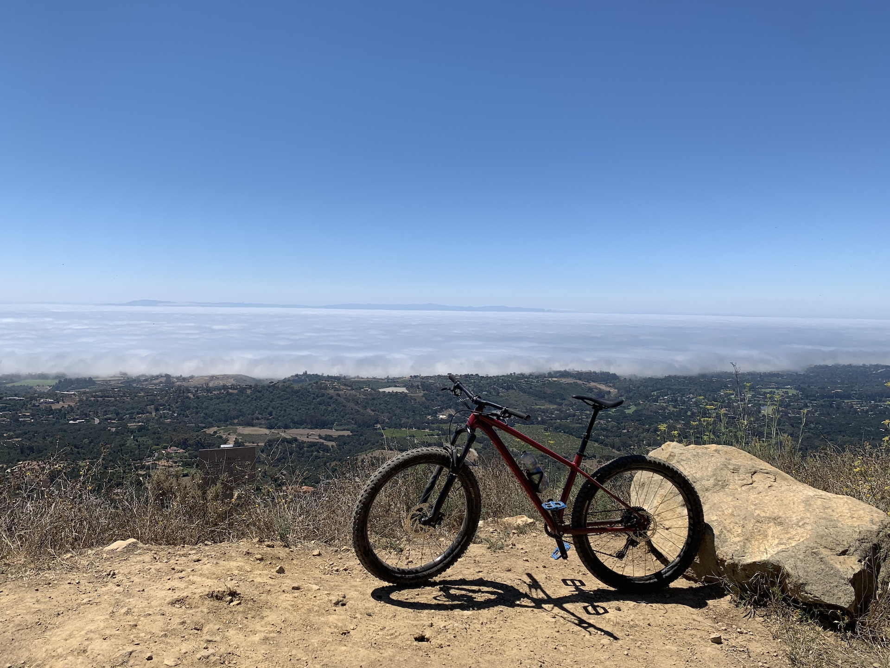

--- 
layout: default 
title: About Me 
output: html_document
---

  

## Past Experience

I have worked as a data analytics intern for UCSB's D1 baseball team,
where I wrote player development research reports coded in R and Python.
In the Spring of 2020, I was Research Assistant helping Professor
Alexander Petersen with the development of his R package, WRI, which
focuses on the estimation of conditional mean densities. As a research
assistant, I helped with the formula interface, package documentation,
and creation of the package vignette. At the same time, I was an
Undergraduate Learning Assistant, where I held individual drop-in office
hours and helped teaching assistants during computer lab sections.

 

## Current Work

I am currently a Data Science Intern at [BigIron
Auctions](https://www.bigiron.com/AboutUs) where I build company
dashboards for visualization of customer behavior and assist with the
development of models to determine likely buyers of equipment. I am also
working as the Transfer Peer Adviser for the Statistics department at
UCSB, where I assist 195 incoming transfer students with admission
steps, course clearance, and schedule planning. In my free time, I am working on a shiny app and a daily California wildfire map.

 

## Future Work

This upcoming year, I will be participating in the Central Coast Data
Science Partnership (
[CCDSP](https://centralcoastdatascience.org/news/all/2020/ucsb-names-first-cohort-nsf-fellows)
). As part of the first Cohort for CCDSP, I am going to get the
opportunity to work with a diverse group of peers to develop the the
UCSB data science curriculum, work in committees for outreach, and work
on capstone projects with local companies to develop my data science
knowledge.

 

## Fun Stuff

 

In my free time, I play club roller hockey (it is a sport) for UCSB, to
which we we have gone to the national championships in 2019, and were
given a bid to participate in the 2020 national championship. When I am
not playing roller hockey, I am either running (ex-cross-country runner)
or going for mountain bike rides to get my dose of adrenaline.
