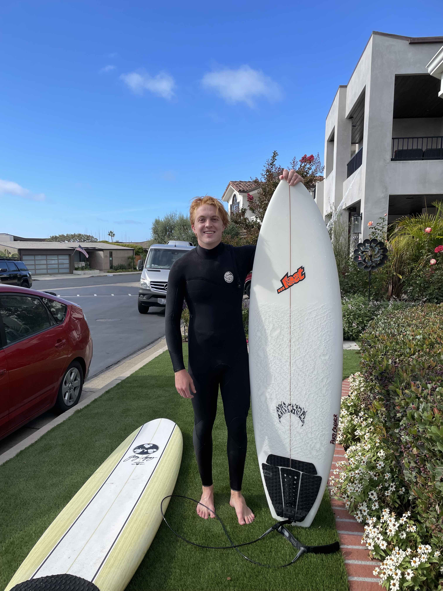

--- 
layout: default 
title: About Me 
output: html_document
---

  

## Past Experience

I have worked as a data analytics intern for UCSB's D1 baseball team,
where I wrote player development research reports coded in R and Python.
In the Spring of 2020, I was Research Assistant helping Professor
Alexander Petersen with the development of his R package, WRI, which
focuses on the estimation of conditional mean densities. As a research
assistant, I helped with the formula interface, package documentation,
and creation of the package vignette. At the same time, I was an
Undergraduate Learning Assistant, where I held individual drop-in office
hours for a Data Science in R course and Bayesian Data Analysis course; this included helping teaching assistants during computer lab sections.

I be participated in the Central Coast Data
Science Partnership (
[CCDSP](https://centralcoastdatascience.org/news/all/2020/ucsb-names-first-cohort-nsf-fellows)
). As part of the first Cohort for CCDSP, I had the opportunity to work with a diverse group of peers and a biomedical company, Evidation Health. This Also allowed me the opportunity to develop the UCSB data science curriculum, work in committees for outreach, and work on capstone projects with local companies to develop my data science knowledge.

I also worked as a Data Science Intern at [BigIron
Auctions](https://www.bigiron.com/AboutUs) where I built company
dashboards for visualization of customer behavior and assist with the
development of models to determine likely buyers of equipment. At the same time, I was
working as the Transfer Peer Adviser for the Statistics department at
UCSB, where I assisted 195 incoming transfer students with admission
steps, course clearance, and schedule planning. 

## Current Work

I am currently working as a data scientist at SAP, a German ERP company focused on creating software which allows businesses to run easier and better.

## Future Work

Looking for opportunities to use my data science knowledge in the public sector to have a positive measurable impact.

 

## Fun Stuff

 

In my free time, I play club roller hockey (it is a sport), to
which we we have gone to the national championships in 2019, and were
given a bid to participate in the 2020 national championship. When I am
not playing roller hockey, I am either running (ex-cross-country runner)
or going for a surf in the gnarly waves of SF's Ocean Beach to get my dose of adrenaline.
