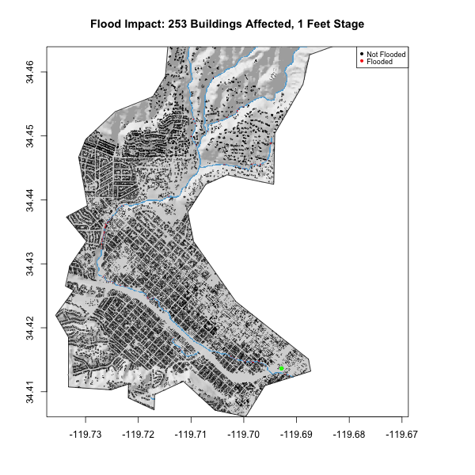
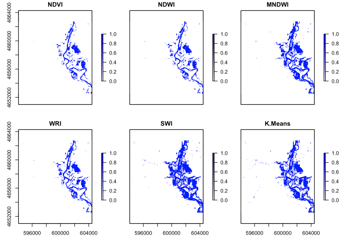

In the summer of 2020, I took a course, Geography 176A - *Introduction to Geographic Information Systems and Science* - Where I was able to apply my knowledge in R in the realm of spatial data. Highlights from the course include:

**************************

## [Building a Project Website](https://matthewbcoleman.github.io/)

- In this lab I built a webpage using only Rmarkdown and the resulting .html files from the knitting.
- Learned how to use different types of YAML commands.
- Learned how to create a navbar (super useful) to navigate between my different pages.

 

## [Exploring COVID-19 Trends](https://matthewbcoleman.github.io/geog-176A-labs/lab-02.html)

{width=40% height=40%}

- In this lab I conducted an investigation into COVID-19 case trends.
- Learned how to create faceted plot to show trends by group.
- Learned the beginnings of mapping in R with ggplot. 

 

## [Distances and Projections](https://matthewbcoleman.github.io/geog-176A-labs/lab-03.html)

{width=40% height=40%}

- Analysis and mapping of cities based on different criteria including distance to US, state, MX, and CA border.
- Learned how to map in ggplot using `geom_sf`
- Learned how to highlight features of interest using `gghighlight` and label points neatly with `ggrepel`

 

## [Tesselations and Webmapping in R](https://matthewbcoleman.github.io/geog-176A-labs/lab-04.html)

{width=40% height=40%}

- Worked with a variety of tessellations including voronoi, triangulated, grid, and hex grid.
- Showed how different tessellations can cause Modifiable Areal Unit Problem (MAUP), resulting in biased maps.
- Explored US Dam characteristics in different tesselations in `ggplot` and through `leaflet` webmapping.

 

## [Identifying Flooding Through K-Means and Landsat Band Combination](https://matthewbcoleman.github.io/geog-176A-labs/lab-05.html)

{width=40% height=40%}

- Used Landsat band combination to create indexes which can be used to distinguish water from land.
- Created a K-Means algorithm which used landsat bands to determine water features from land features.
- Plotted rasters of flooding areas and water flood uncertainty in OpenStreetMap and base R. 

 

## [Raster Analysis of Flooding in Santa Barbara](https://matthewbcoleman.github.io/geog-176A-labs/lab-06.html)

{width=40% height=40%}

- Explored Santa Barbara Basin and Mission Creek River System.
- Used Terrain Analysis to create Elevation, Hillshade, and *Height Above Nearest Drainage* (HAND) rasters. 
- Visualized 2017 Santa Barbara Flood Incident, including flood area, flood depth, and affected buildings.
- Created Animation showing affected buildings and flood area for different river flood heights

