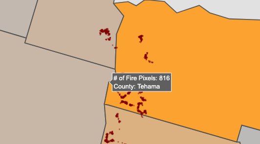
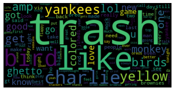
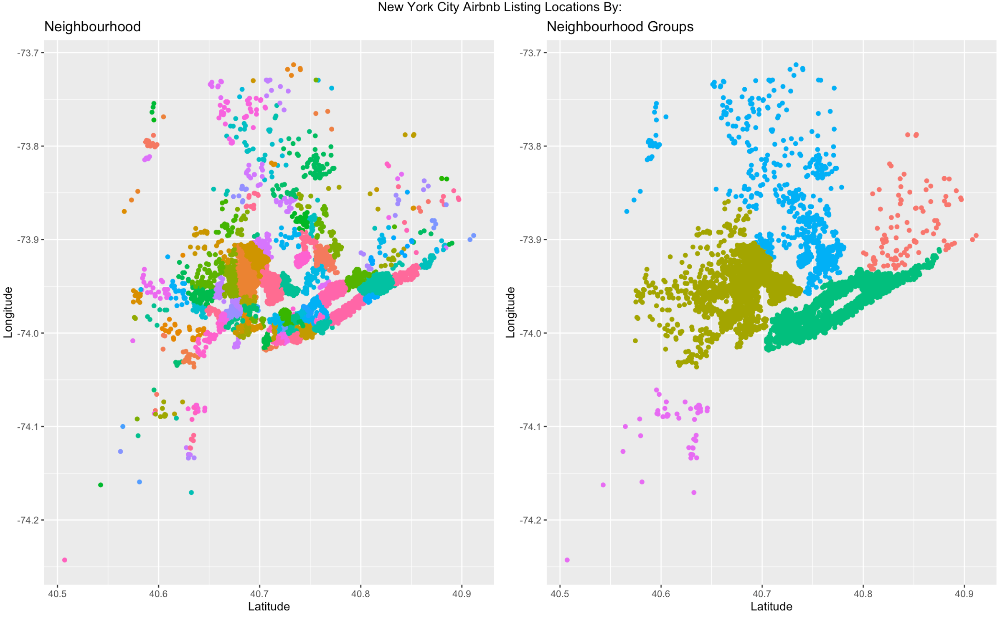
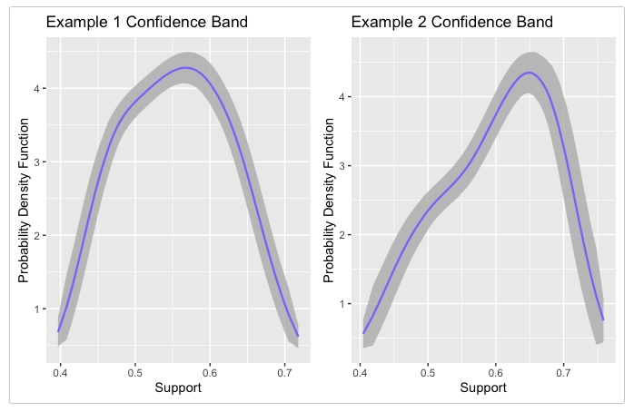
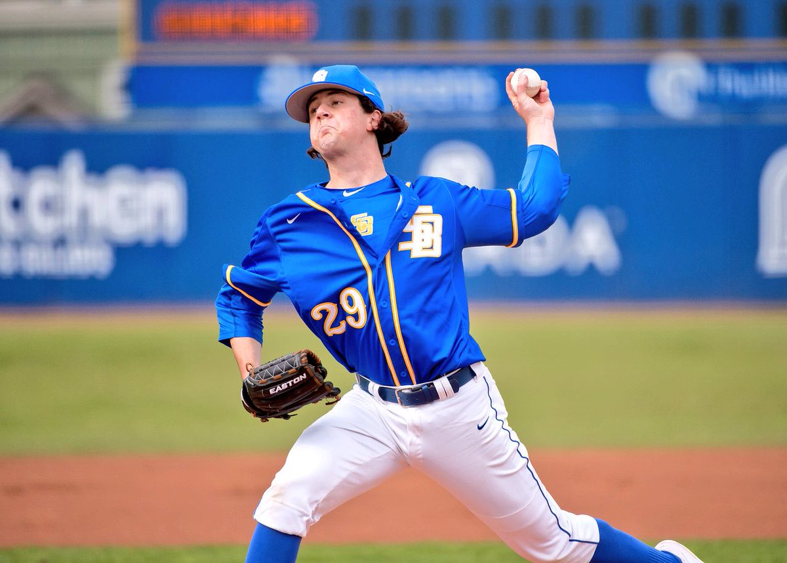
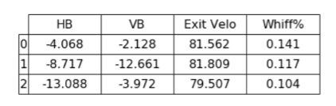
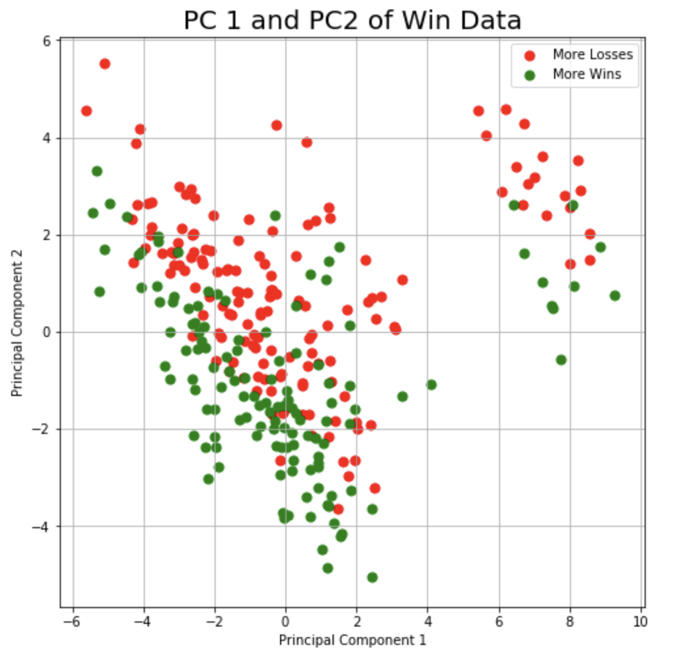

--- 
title: Projects
output: 
  html_document:
    toc: true
    toc_float: true
    toc_collapsed: true
---
```{r, echo = FALSE}
library(icon)
```

<br> 

# **Current Projects**

***

### Online Shoe Store Product Information Scraper <i class="fab fa-python"></I>

I am currently working on a scraper which gets information (price, shoe type, reviews, etc.) from running shoes on runningwarehouse.com. This data could then be used to create a running shoe recommender system or to determine the most important features of a shoe based on reviews.


### Simple California Wildfire Map Shiny App <i class="fab fa-r-project"></I> ([App](http://matthewbriancoleman.shinyapps.io/CaliforniaWildfireMap))

<center>
{width=35% height=35%}
{width=40% height=40%}
</center>

<center>
[App](http://matthewbriancoleman.shinyapps.io/CaliforniaWildfireMap)
and
[Code](https://github.com/matthewbcoleman/wildfireapp)
</center>

Using [NASA's VIIRS I-Band 375m Active Fire Data](https://earthdata.nasa.gov/earth-observation-data/near-real-time/firms/viirs-i-band-active-fire-data) and county borders for California, this app uses ggplot and plotly to create an interactive daily map of wildfires in California. 

<br>

```{r, include = F}
### Machine Learning Shiny App <i class="fab fa-r-project"></I>

# <center>
# {width=25% height=25%}
# </center>
# 
# <center>
# [Code](https://github.com/matthewbcoleman/mlshinyapp/blob/master/ml_shiny_app.R)    
# </center> 
# 
# During my free time, I am developing a shiny app which allows users to upload any `.txt` file or Excel file and then allow the user to choose a common machine learning algorithm to run selected analyses on the data. There will be an output which summarizes key points/findings in the analysis and also returns a `.csv`/Excel with a prediction column appended.

```


# **Past Projects**

***

### Twitter Hate Speech Classifier in Pyspark <i class="fab fa-python"></I>

<center>

</center>

<center>
[Code](https://github.com/matthewbcoleman/school_projects/blob/master/Hate_speech_classifier/classifier.ipynb)
and
[Report](https://github.com/matthewbcoleman/school_projects/blob/master/Hate_speech_classifier/Project%20Report.pdf)
</center>

In this project, my group and I aimed to classify tweets from a 25,000 tweet dataset as hate, offensive, or regular speech using PySpark. Using cross-validation on naive-bayes and logistic regression models, we were able to decide on a logistic regression model with stop words removed from the tweets. Using this model, we were able to achieve an overall accuracy of 88.38% on the test set. In this project, I did most of the development on the Logistic Regression model and final analysis in the report.

<br>

### New York Airbnb Price Regression and Median Price Classification <i class="fab fa-r-project"></I>

<center>
{height=75% width=75%}
</center>

<center>
[Code](https://github.com/matthewbcoleman/pstat131_project/blob/master/airbnb_project.Rmd)
and 
[Report](https://github.com/matthewbcoleman/pstat131_project/blob/master/airbnb_project.pdf)
</center>

In this project, we had two main goals: First was prediction of New York Airbnb listing prices and second was classification of a Airbnb listing price as above or below the median price. In this project, we attempted all of the following methods to choose the best model:

- Classic linear regression, logistic and regularized regression 
- Tree-based methods
- K-Nearest-Neighbors
- Linear and Quadratic Discriminant Analysis
- Support Vector Machines

For our final models, we chose OLS Regression and Logistic regression. Both of these models were *marginally* less-accurate than some of the other models, so our main point of decision for the classical models was reduced complexity and interpretation of parameters. 

<br> 

### Collaborator on WRI, an R package <i class="fab fa-r-project"></I>

<center>
{height=75% width=75%}
</center>

<center>
[Paper](https://arxiv.org/abs/1910.13418)
</center>

I assisted Professor Alexander Petersen with the development of his R package, `WRI`, which is used to estimate conditional mean densities. My main tasks included:

- Implementing function interface for main Wasserstein Regression Function.
- Authoring and codingthe package vignette which displays the package's functions and usage. 
- Writing and editing function documentation.

<br>

### Unsupervised Cluster Analysis of NCAA D1 Curveballs <i class="fab fa-python"></I>

<center>
{width=45% height=45%}
{width=50% height=50%}
</center>

<center>
[Code](https://github.com/matthewbcoleman/baseball_projects/blob/master/curveballs/final_notebook.ipynb)
and 
[Report](https://github.com/matthewbcoleman/baseball_projects/blob/master/curveballs/Curveball%20Cluster%20Analysis%20Paper%20(Python).pdf)
</center>

In this project, we analyzed pitch data on D1 baseball curveball pitches through unsupervised clustering. We computed the clusters using K-Means and Gaussian Mixture Models, then determined there were 3 main curveball types through the elbow method and silhouette score. After determining 3 main curveball types, we observed the different qualities of these pitches, and their effects on offensive variables such as whiff percentage (swing-and-missed percentage). We then computed t-tests to determine cluster significance, and collected all the variables to an easily-readable output. 


<br> 

### Batting Point of Contact Analysis <i class="fab fa-r-project"></I>

<center>
{width=47% height=47%}
{width=50% height=50%}
</center>

<center>
[Code](https://github.com/matthewbcoleman/baseball_projects/blob/master/poc_analysis/POC_analysis.Rmd)
and
[Report](https://github.com/matthewbcoleman/baseball_projects/blob/master/poc_analysis/Point%20of%20Contact%20Final.pdf)
</center>

The main purpose of this research was to explore the relationship between a batters point-of-contact with the ball and offensive variables such as ball exit velocity. Using local polynomial regression, I was able to determine many of the batters optimal point-of-contact, and how they could correct their swings to achieve the best offensive outcomes. This allowed the coaching staff to give individual, specialized coaching to our batters and dial-in their batting. 

<br> 

### MLB Win Rate and Salary Prediction <i class="fab fa-python"></I>

<center>
{width=35% height=35%}
</center>

<center>
[Code](https://github.com/matthewbcoleman/school_projects/blob/master/salary_wins_project/int15proj_FINAL_VERSION.pdf)
and
[Report](https://github.com/matthewbcoleman/school_projects/blob/master/salary_wins_project/INT_15_Final_Report.pdf)
</center>

For my *Principles & Techniques of Data Science* course, I decided to carry out an analysis on MLB player salaries and team win percentages. Through logistic regression, I  was able to determine with an accuracy of 90% whether a team would win a game based on the ratio of scored runs to runs against. Further, through PCA, I was able to determine two main groups based on win percentage, and were able to determine within those two groups there were differences based on whether teams had more wins than losses in a season. Through my exploration into player salaries, I was able to determine in-game performance is a poor predictor of a players salary.

<br>

### Exploring the Relationship Between Spin Rate and Pitch Velocity <i class="fab fa-r-project"></I>

<center>
{width=75% height=65%}
</center>

<center>
[Code](https://github.com/matthewbcoleman/baseball_projects/blob/master/spinrate_velo/spin_rate_velo.Rmd)
and
[Report](https://github.com/matthewbcoleman/baseball_projects/blob/master/spinrate_velo/spinrate_vs_velo.pdf)
</center>

Here, I explored whether there was a relationship between pitch spin rate and velocity. I discovered many pitchers had low-variability groupings of pitches, instead of a spectrum of different pitches. These groupings could then be observed to determine specific pitcher patterns and give insight into pitcher behavior.
<br>
